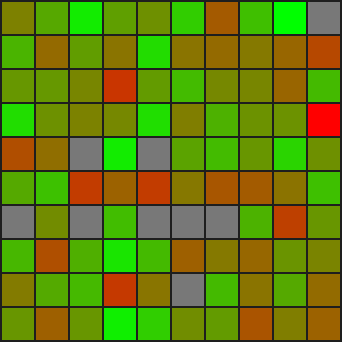
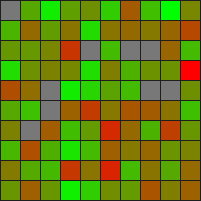

# Deep Reinforcement Learning Minesweeper Agent

A PyTorch agent that learns to play 10 x 10 Minesweeper with 9 mines. The project compares a baseline agent with an optimized training configuration and includes evaluation visualizations, saved training statistics, and gameplay GIFs.

## Results at a glance

| Version | Entry point | Training episodes | Reported win rate |
| --- | --- | ---: | ---: |
| Baseline | `agent.py` | 15,000 | 20% |
| Optimized | `agent1.py` | 100,000 | 30% |

The optimized run improves the reported win rate by 10 percentage points (50% relative). The included `.npz` files contain statistics from completed runs. Exact results can vary with hardware, random initialization, and training time.

## Demo

| Baseline | Optimized |
| --- | --- |
|  |  |

## Approach

The agent uses a convolutional Q-network to map an 11-channel board representation to one Q-value per board cell. Its training loop combines:

- frontier-based action masking to focus exploration on relevant unopened cells;
- experience replay with a capacity of 500,000 transitions;
- a target network for more stable temporal-difference updates;
- an epsilon-greedy exploration schedule;
- reward shaping for progress, guesses, invalid exploration, and terminal outcomes.

The network contains three convolutional layers followed by a 512-unit fully connected layer and a 100-action output head.

## Repository guide

| File | Purpose |
| --- | --- |
| `minesweeper.py` | Game environment and board logic. |
| `agent.py` | Baseline training implementation. |
| `agent1.py` | Optimized training configuration. |
| `plot_ddqn_stats.py` | Plots opened cells, progress, guess ratio, win rate, and episode reward. |
| `eval_ddqn_frontier_pygame.py` | Visual evaluation with Pygame and optional GIF export. |
| `*.npz` | Statistics from completed training runs. |
| `Minesweeper project report.pdf` | Full project report. |

## Quick start

```bash
git clone https://github.com/Lsdaer-1/Minesweeper-agent.git
cd Minesweeper-agent
python -m venv .venv
source .venv/bin/activate
python -m pip install -r requirements.txt
```

On Windows, activate the environment with `.venv\\Scripts\\activate`.

### Train

Run either implementation directly:

```bash
python agent.py
python agent1.py
```

A full run can take about five hours, depending on the machine. The scripts save a PyTorch checkpoint (`.pt`) and training statistics (`.npz`) when training completes.

### Plot training statistics

Set the input filename in `plot_ddqn_stats.py` to one of the included `.npz` files, then run:

```bash
python plot_ddqn_stats.py
```

### Evaluate and export a GIF

Train an agent first, then set `MODEL_PATH` in `eval_ddqn_frontier_pygame.py` to the generated checkpoint:

```bash
python eval_ddqn_frontier_pygame.py
```

The repository includes demo GIFs and statistics, but not the trained `.pt` checkpoint referenced by the evaluation script.

## Limitations and next steps

- The current scripts use fixed configuration constants instead of command-line arguments.
- Results are reported for a single 10 x 10 board configuration with 9 mines.
- Reproducible evaluation would benefit from committed random seeds, version-pinned dependencies, and a downloadable trained checkpoint.
- Future experiments could compare DQN variants, ablate reward shaping and frontier masking, and report mean performance across multiple seeds.
